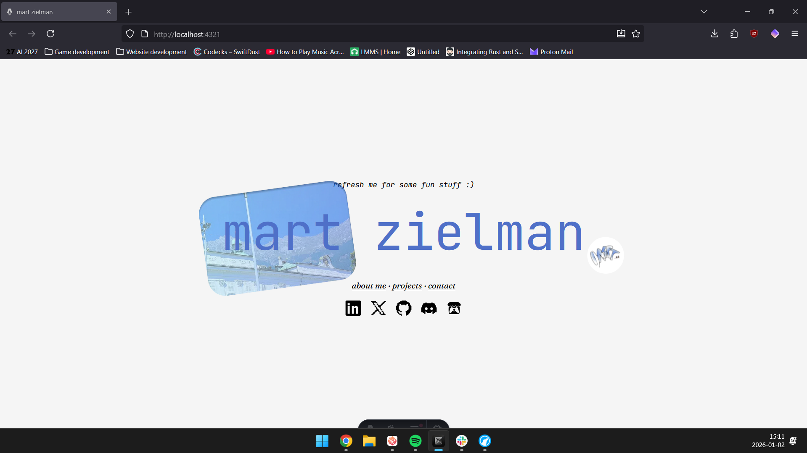

# m4rt.nl

My personal website! Written in Astro and Tailwind CSS. It's all on a single page and I tried to keep it as simple as possible. You might still find it a lot of yap though.

Run `npm run i` and `npm run dev` to start the development server. Build with `npm run build`.

If you want to run this on a server like I did on my Raspberry Pi, you can just make sure Node and NPM are installed on the target machine, then run npm run build, serve it using something like pm2 and reverse proxy it using Caddy. If you want to use Vercel, you need to install the adapter for that, current is Node. For that please refer to the documentation of Astro.
I'm going to make a detailed tutorial on this on YouTube. The link will be posted here when it's done.
